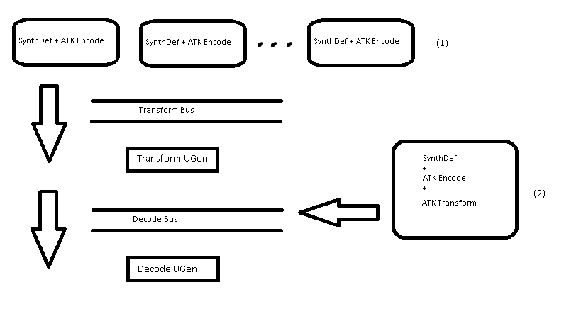

We are working with [Ambisonic surround sound](https://en.wikipedia.org/wiki/Ambisonics) in this project, and to make things easier we use the Ambisonic Toolkit (ATK) which offers a great number of encoders and decoders.

Check [Introducing the Ambisonic Toolkit](http://www.ambisonictoolkit.net/Help/Guides/Intro-to-the-ATK.html) if you want to get more info.

You have to install [SC plugins](https://github.com/supercollider/sc3-plugins) (which includes ATK) to get the examples working.
Follow installation instructions at their [github repository](https://github.com/supercollider/sc3-plugins)

Some quick tips to build from source:

  git clone https://github.com/supercollider/supercollider.git
  git clone https://github.com/supercollider/sc3-plugins.git
  cd sc3-plugins
  git submodule init && git submodule update
  mkdir build && cd build
  cmake -DSC_PATH=../../supercollider ..
  make
  make install
  mv SC3plugins /paht/to/sc3-extensions #(you find out which one that is by evaluating Platform.userExtensionDir from within SuperCollider).

Make also sure that `MathLib` is installed. You can do so by executing `Quarks.gui` in supercollider IDE.
You should recompile the class labrary after installing  `MathLib` ( Language -> Recompile Class Library)

Here's a diagram of the atk infrastrcuture we'll use:

